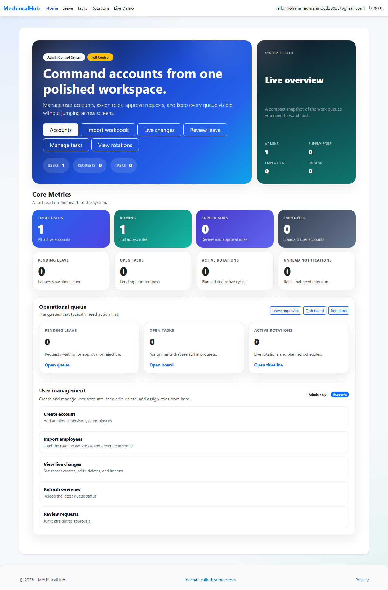
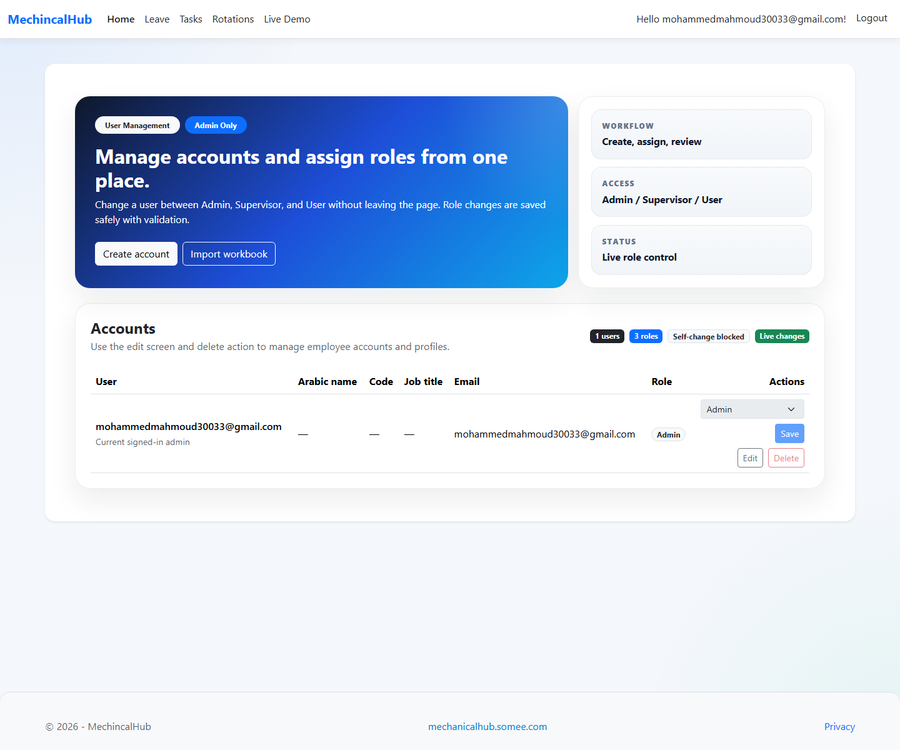

# HRSystem

HRSystem is an ASP.NET Core MVC application for managing core HR workflows such as employees, roles, leave requests, rotations, tasks, and admin activity.

## Live Demo

The published app is available at:

http://mechanicalhub.somee.com/

## Screenshots






## Features

- ASP.NET Core MVC with Razor views
- ASP.NET Identity with role-based access
- EF Core with SQL Server LocalDB
- Automatic database migration on startup
- Live change log updates through SignalR
- Admin screens for users, roles, settings, and activity
- Employee, supervisor, and admin dashboards
- Leave management
- Rotation scheduling
- Task management
- Employee import/export helpers

## Prerequisites

- .NET 10 SDK
- SQL Server LocalDB, or another SQL Server instance

## Configuration

The app uses the connection string in `appsettings.json`:

```json
"ConnectionStrings": {
  "DefaultConnection": "Server=(localdb)\\MSSQLLocalDB;Database=HRSystem;Trusted_Connection=True;MultipleActiveResultSets=true;TrustServerCertificate=True"
}
```

If you want to use a different database server, update `DefaultConnection` before running the app.

## Run Locally

```powershell
dotnet restore
dotnet run
```

On startup, the app applies EF Core migrations and seeds the Identity roles and users.

## Database

The project includes EF Core migrations under `Data/Migrations`. The database is created and updated automatically when the app starts.

## Project Structure

- `Controllers/` - MVC controllers
- `Data/` - EF Core context and migrations
- `Hubs/` - SignalR hubs
- `Infrastructure/` - services, import/export helpers, and identity seeding
- `Models/` - entities and view models
- `Views/` - Razor views
- `wwwroot/` - static assets

## Notes

- The repository ignores build output, IDE files, and local database files.
- The app uses ASP.NET Identity, so the first startup may create the required schema and seed roles automatically.
